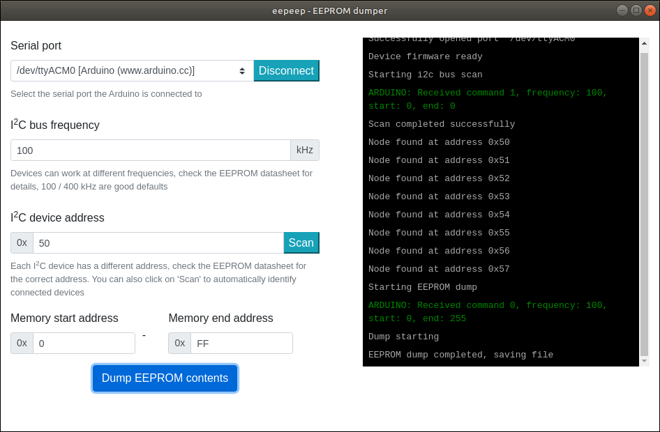
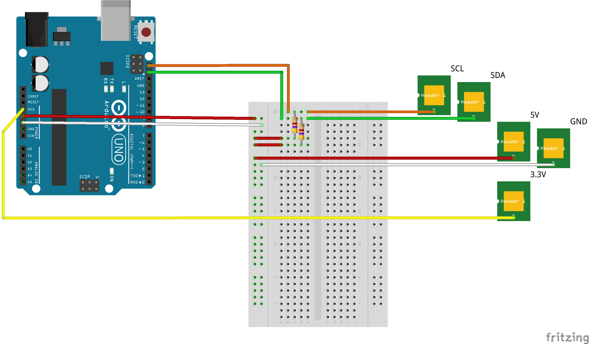

# eepeep: in-circuit EEPROM dumper

During the reverse engineering of hardware systems it is handy to be able to dump EEPROMs without removing them from the circuit under examination, it makes for faster and easier system analysis. `eepeep` comes with a preconfigured list of EEPROMs for ease of use but it can be customised to extract any EEPROM that supports the I<sup>2</sup>C protocol.

`eepeep` hardware component connects to the EEPROMs using logical probes and then the software component is used to run the extraction.



You can find a detailed step-by-step guide on extracting EEPROMs with eepeep in [this blog post](https://flow.gi/eepeep/).

## Hardware component

The hardware component acts as a bridge between the client and the EEPROM, implementing the bus scanning and EEPROM access protocols. At its core it is a state machine that receives messages from the client (scan bus, dump eeprom) and translates these to the I<sup>2</sup>C protocol commands that interact with the EEPROMs.

### Arduino hardware implementation

The reference implementation of the hardware component uses an Arduino Uno and a couple of 4.7k resistors, this is the BOM:

* Arduino UNO
* 2 x 4.7k resistors

The following schematic shows the simplicity of the hardware component:



Flash the Arduino with the [eepeep firmware](server/arduino/eepeep/eepeep.ino) and you are ready to go, just connect the SCL, SDA, Vcc and GND ports using logic probes (or anything you can get your hands on that does the job) and move to the software component.

## Software component

The software component of `eepeep` is an ElectronJS application that communicates with the hardware component through serial port commands, precompiled binaries are available for the following platforms:

* [Windows](https://github.com/llmora/eepeep/releases/download/1.0/eepeep%20Setup%201.0.0.exe)
* [Linux x64 .deb](https://github.com/llmora/eepeep/releases/download/1.0/eepeep_1.0.0_amd64.deb)
* [Linux x64 .rpm](https://github.com/llmora/eepeep/releases/download/1.0/eepeep-1.0.0.x86_64.rpm)
* [Linux AppImage](https://github.com/llmora/eepeep/releases/download/1.0/eepeep-1.0.0.AppImage)
* [Linux snap](https://github.com/llmora/eepeep/releases/download/1.0/eepeep_1.0.0_amd64.snap)

If your platform is not listed of you prefer to compile the software yourself just checkout this repository and execute the following command:

```console
$ cd client && yarn dist
```
Before you launch the software client make sure the hardware component is connected and powered up through USB.

# Contributing to eepeep

If you find `eepeep` useful consider contributing to its development by sharing issues you face during it usage, submitting pull requests to add new functionality or suggesting ideas for improvement. If you end-up developing code for `eepeep` you will find the following commands useful:

  * `yarn test`: runs the test suite
  * `yarn dev`: runs a fully-functional development instance of the client

If you submit new functionality it will be great it you can submit test cases to automatically confirm the functionality is working as expected, `eepeep` uses mocha as the test framework.

## Pending functionality

If you are in the mood to implement new functionality for `eepeep` the following list shows the prioritised list of pending functionality; it will be eventually implemented but certainly it will be faster if you implement it :-)

*Release 1.1*
  * Refresh list of ports dynamically
  * Show firmware version in welcome message
  * Prefix time with console log entry
  * Checksum verification
  * Add preloaded configurations for at least 5 EEPROMs (and test them)
  * Write tests for UI interaction
  * Add logo
  * Scan result as bit-pack of 0 and 1 instead of ASCII
  * Add autoupdate capabilities (https://www.electron.build/auto-update)
  * Compile binaries for MacOS

*Release 1.2*
  * Implement SPI
  * Achieve 100% test coverage
  * ...
